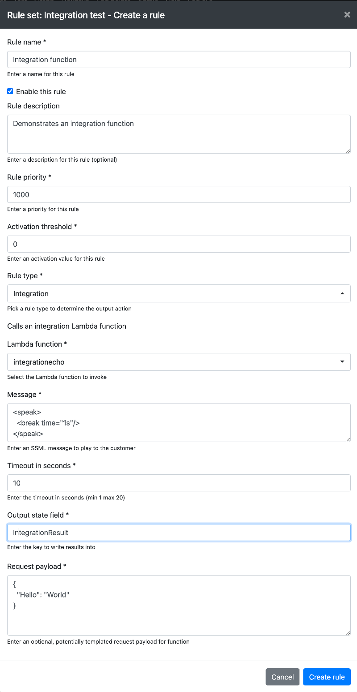
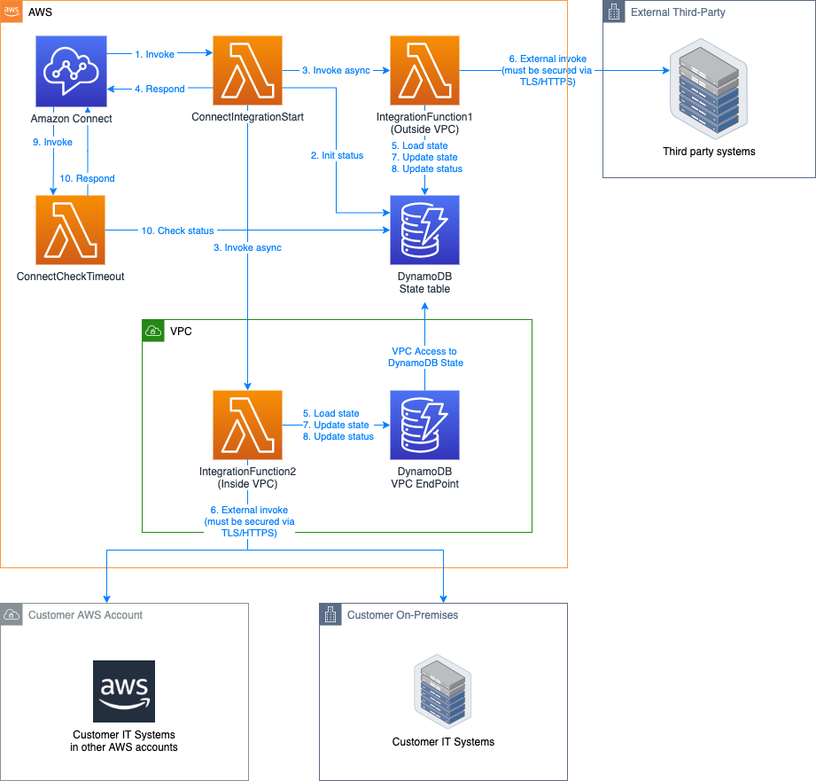
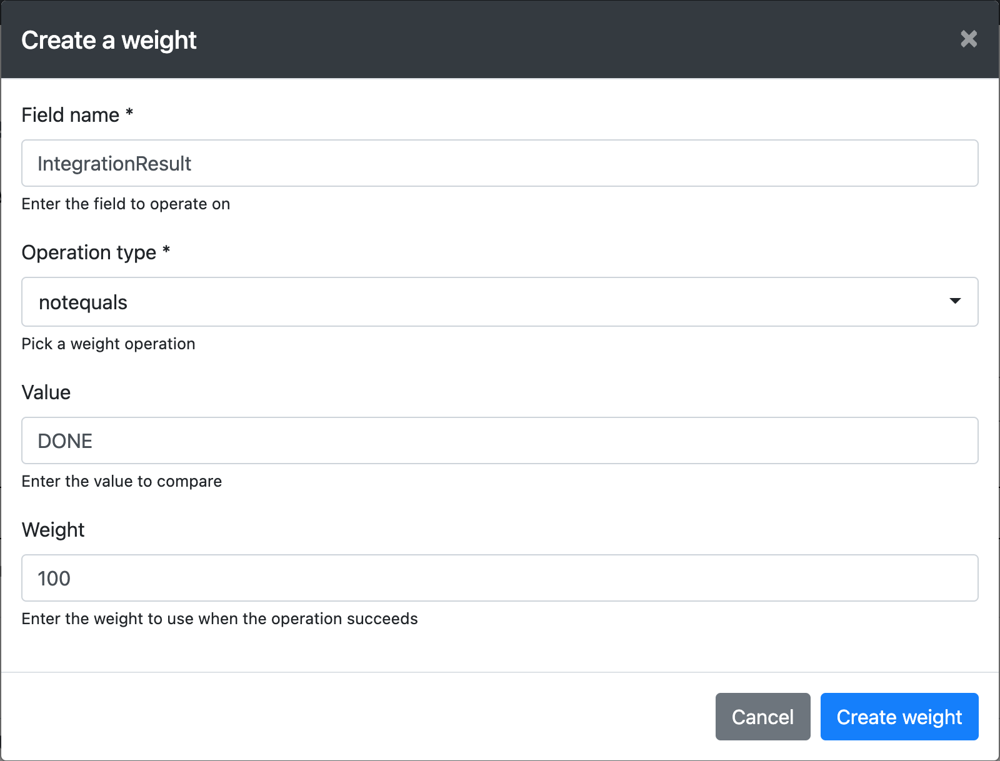

# Extending Rules Engine for Amazon Connect

The Rules Engine provides a business friendly user interface to create engaging customer experiences running on Amazon Connect.

Often customers have external and on-premises data sources they wish to access to:

- Load customer data for personalised and routing
- Access external transactional systems to create cases, make purchases and create appointments

These actions can be implemented simply using Rules Engine Integration Lambda Functions.

The Integration Rule has another benefit in that Lambda functions invoked by Amazon Connect must usually complete within 8 seconds. This is not always possible to achieve with external systems for multiple reasons. The pattern detailed below allows playing comfort messages to customers and extends the maximum Lambda time-out to 20 seconds (if required).

## Introduction

To access a correctly deployed Integration Function, you simply create a Integration Rule (with appropriate weights) in a rule set:

The Lambda function dropdown shows the list of currently deployed Lambda functions that can be invoked.

The naming of these at deployment time is important, Rules Engine will show Lambda functions that are named:

	<stage>-<service>-integration<function name>

Lambda functions are cached in the config table hourly by Rules Engine, you can trigger a reload using the Admin / Refresh cache button.

A sample Lambda Integration Function is provided that simply echoes the input request payload into the output state field:

	src/lambda/integration/IntegrationEcho.js

## Architecture Overview

The following diagram shows the interaction between Amazon Connect and your integration Lambda function and back end systems:

### Process flow

1. Amazon Connect starts the integration process by synchronously invoking the proxy ConnectIntegrationStart Lambda function provided by Rules Engine.

2. The ConnectIntegrationStart function updates the DynamoDB State table to indicate that the integration Lambda function is starting by setting the state field `IntegrationStatus` equal to `START`. It also saves `IntegrationStart` to state containing an ISO-8601 timestamp with millisecond accuracy.

3. ConnectIntegrationStart then invokes your Integration Lambda function asynchronously. Note that Lambda functions can be deployed in VPC (for access to restricted resources), or as standard functions (to gain Internet access to external resources). It then waits for up to 2 seconds for your function to complete by polling the DynamoDB State table for a `DONE` or `ERROR` status in the field: `IntegrationStatus`.

4. ConnectIntegrationStart responds back to Connect after a maximum of 2 seconds. If your function is already complete, the process is now complete.

5. Your function receives the request payload and loads the current customer state from DynamoDB, either directly or via a DynamoDB VPC end point.

6. External systems are invoked if required. These could be on-premises and on-cloud systems that require VPC network routing.

7. The results from the external systems can be massaged and then saved to customer state in DynamoDB using the configured output state field name.

8. The status of Lambda function is written by your function indicating `DONE` or `ERROR` in the value of the `IntegrationStatus` field.

9. If value of `IntegrationStatus` did not reach `DONE` or `ERROR`, the integration contact flow will continue calling the `ConnectCheckTimeout` function which polls DynamoDB for state changes in `IntegrationStatus`. If the whole process takes longer than the configured timeout for the rule, then `IntegrationStatus` is set to `TIMEOUT`. Otherwise the process completes.

10. The `ConnectCheckTimeout` function completes, the value of `IntegrationStatus` is now `DONE`, `ERROR` or `TIMEOUT` and can be inspected in subsequent rules.

## Function Anatomy

Integration Lambda functions will have the following common steps

- Logging the integration start
- Parsing and validating the request payload
- Loading state from DynamoDB
- Marking the status as `RUN`
- Doing the required work
- Marking the status as `DONE` or `ERROR`
- Logging the integration result

The source code for `src/lambda/integration/IntegrationEcho.js` is provided for reference below:

	var moment = require('moment');
	var requestUtils = require('../utils/RequestUtils');
	var dynamoUtils = require('../utils/DynamoUtils');
	var inferenceUtils = require('../utils/InferenceUtils');

	/**
	 * Simplest integration lambda function that echos
	 * the request payload into the output state field
	 */
	exports.handler = async(event, context, callback) =>
	{

	  var contactId = undefined;
	  var customerState = undefined;

	  try
	  {
	    requestUtils.logRequest(event);

	    requestUtils.requireParameter('ContactId', event.ContactId);
	    requestUtils.requireParameter('OriginalRequest', event.OriginalRequest);
	    requestUtils.requireParameter('Payload', event.Payload);

	    // The contact id is sourced from the initial contact id
	    contactId = event.ContactId;

	    // The original request is passed in as a string
	    var originalRequest = event.OriginalRequest;

	    // This could be JSON but is passed in as a string
	    var payload = event.Payload;

	    // See if a sleep time is configured
	    var sleepTime = 0;
	    var forcedError = undefined;

	    try
	    {
	      var parsedPayload = JSON.parse(payload);

	      if (inferenceUtils.isNumber(parsedPayload.SleepTime))
	      {
	        sleepTime = +parsedPayload.SleepTime * 1000;
	      }

	      if (parsedPayload.ForcedError !== undefined)
	      {
	        forcedError = parsedPayload.ForcedError;
	      }
	    }
	    catch (parseError)
	    {
	      console.error('Did not receive a valid JSON payload: ' + payload);
	    }

	    // Load customer state
	    customerState = await dynamoUtils.getParsedCustomerState(process.env.STATE_TABLE, contactId);

	    console.info('Loaded customer state: ' + JSON.stringify(customerState, null, 2));

	    requestUtils.requireParameter('CurrentRule_functionOutputKey', customerState.CurrentRule_functionOutputKey);

	    // Mark this integration as RUNNING
	    var toUpdate = [ 'IntegrationStatus' ];
	    customerState.IntegrationStatus = 'RUN';
	    await dynamoUtils.persistCustomerState(process.env.STATE_TABLE, contactId, customerState, toUpdate);

	    // Log that we have started
	    inferenceUtils.logIntegrationRun(contactId, customerState);

	    // Usually this is where you would do some work, call an external webservice
	    // we will simply echo back the payload into customerState[customerState.CurrentRule_functionOutputKey]
	    var processedResponse = payload;

	    console.log('Sleeping for: ' + sleepTime);

	    if (forcedError !== undefined)
	    {
	      console.error('Triggering a forced error');
	      throw new Error(forcedError);
	    }

	    await inferenceUtils.sleep(sleepTime);

	    // Update state and mark this as complete writing the result into the requested state key
	    customerState[customerState.CurrentRule_functionOutputKey] = processedResponse;
	    customerState.IntegrationStatus = 'DONE';
	    customerState.IntegrationErrorCause = undefined;
	    customerState.IntegrationEnd = moment().utc().format('YYYY-MM-DDTHH:mm:ss.SSSZ');
	    toUpdate = [ 'IntegrationStatus', 'IntegrationEnd', 'IntegrationErrorCause', customerState.CurrentRule_functionOutputKey];
	    await dynamoUtils.persistCustomerState(process.env.STATE_TABLE, contactId, customerState, toUpdate);

	    // Log the done result
	    inferenceUtils.logIntegrationEnd(contactId, customerState, 'DONE', undefined);
	  }
	  catch (error)
	  {
	    // Update the failure state if possible
	    if (customerState !== undefined && contactId !== undefined)
	    {
	      customerState.IntegrationStatus = 'ERROR';
	      customerState.IntegrationErrorCause = error.message;
	      customerState.IntegrationEnd = moment().utc().format('YYYY-MM-DDTHH:mm:ss.SSSZ');
	      customerState[customerState.CurrentRule_functionOutputKey] = undefined;
	      toUpdate = [ 'IntegrationStatus', 'IntegrationEnd', 'IntegrationErrorCause', customerState.CurrentRule_functionOutputKey ];
	      await dynamoUtils.persistCustomerState(process.env.STATE_TABLE, contactId, customerState, toUpdate);

	      // Load the error result
	      inferenceUtils.logIntegrationEnd(contactId, customerState, 'ERROR', error);
	    }
	    // Log the failure but skip state recording due to missing contact id
	    else
	    {
	      console.error('Skipping recording failure as no state or contact id is available', error);
	    }
	  }
	};

Additional refactoring of common code is advised for large numbers of integration functions.

### Additional IntegrationEcho settings

The IntegrationEcho request payload can contain the following optional keys:

	{
	  "ForcedError": "Error cause",
	  "SleepTime": "1000"
	}

Causing a forced exception and error result with a `ForcedError` cause and a delayed response with: `SleepTime`.

Using these flags it is possible to test your customer experience with various delays and error scenarios.

## Security and Resiliency Considerations

This section details best practice security for various scenarios.

### Securely accessing external systems

As integration requests leave your AWS account to access on-premises and on-cloud systems, AWS strongly advises customers ensure that API access is made via secure channels (TLS).

### Securing external credentials

If security credentials are required for accessing external systems, these credentials should be stored encrypted in AWS Secrets Manager and fetched in your Lambda function.

### Launching in VPC

If your Lambda function is required to run in VPC to access resources on premises or in other VPCs, you will need to deploy the function into a VPC with appropriate routing and security group and host in at least 3 subnets, each in different availability zones.

### Handling errors

Integration Lambda functions will update the value of `IntegrationStatus` equal to `DONE` on success and `ERROR` on internal or remote failure. A status of `TIMEOUT` will be set if the function takes longer than the configured rule timeout.

Subsequent rules can thus weight on the value of `IntegrationStatus` `notequals` `DONE` to handle both `ERROR` and `TIMEOUT` scenarios and route the user accordingly.

For example, there is a weight attached to a RuleSet rule that checks the result of the last integration function and adds 100 to the activation threshold if the previous integration rule failed for any reason:

Other weighting scenarios considering `ERROR` and `TIMEOUT` are also possible.
