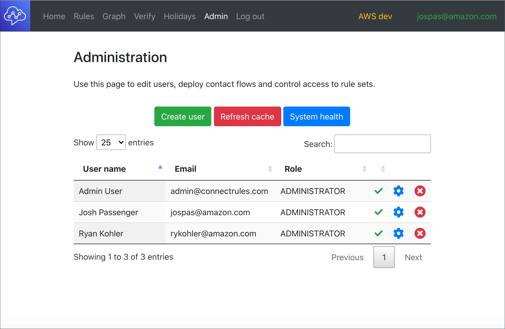

# Rules Engine for Amazon Connect

This project aims to deliver an engine sitting on top of Amazon Connect which has the capability to build a hyper-personalised IVR (DTMF and NLU) experience for your customers across voice and chat channels.

## What is Rules Engine for Amazon Connect?

Rules Engine for Amazon Connect (Rules Engine) is an open source, self-hosted web application providing the ability to build, test and deploy customer experiences based on a set of prioritised rules. 

Rules Engine provides pre-built rule types for you to use (17 types of rules are currently provided) which are the functional units of a consistent and exceptional customer experience.

Each rule is self-defined, triggering an action when certain conditions (defined by the user) are met. 

The Rules Engine web application offers a simple user interface to create, test, deploy and manage rules using a single pane of glass, removing the undifferentiated heavy lifting for creating and managing complex customer experiences. 

This allows you to focus on creating and improving customer experiences, instead of spending time on managing contact flows, testing and deployment.

## What are the benefits of rules engine?

Rules Engine makes it easy to create, manage, configure, test and deploy contact experiences.

### Create
        
Rules Engine is built with consistency and reusability in mind. With consistency, the process of creating a rule is always the same, using a pre-built template, populating fields based on the desired experience. 

In terms of reusability, modular customer experiences often have common inputs, outputs and conditions. Rules Engine provides the ability to share and clone rules, allowing you to build patterns knowing you can easily reuse the rules, creating units of reusable contact experiences.

### Manage and configure

Rules Engine organises rules into rulesets (a group of rules). The Rules Engine interface provides the flexibility to name, arrange and nest rulesets, presenting a simple view for rulesets as a folder-like structure. 

This makes it easy to find, manage and configure rules, especially for large scale customer experiences. Rulesets from an environment can be easily exported as a single JSON data file, stored in version control and imported into higher environments, ensuring that business logic can be effortlessly migrated between customer Rules engine instances.

### Increase productivity and reduce development times
 
Rules Engine provides an interactive interface simulating the customer experience journey step-by-step. This helps experience creators understand and debug the experience, accepting optional mock input data for the experience interaction.

### Test

All customer experiences created in Rules Engine are testable and assertable. An integrated testing interface is provided within Rules Engine for testing the end-to-end experience through test scripts. 

Similar to rules, tests can be grouped into folders, allowing for easy management. Executed tests also report the coverage of all rule sets and customers can leverage this to ensure all customer paths are tested.

### Deploy

The Rules Engine solution is open-source, providing full read-access to all files required to deploy and update Rules Engine, and can be integrated with almost any CICD pipeline. 

With the pipeline set up, any rules created or modified can be easily deployed to the Amazon Connect instance, reducing deployment risks by tracking changes through CICD setup and version control, providing the ability to rollback to a previous state in the unfortunate event of an unsuccessful deployment.

### Personalisation and routing

Customers want to feel valued, and to achieve this, one way is to provide a completely tailored experience to demonstrate they are being understood. A tailored experience requires driving the customer experience through matching customer attributes based on the valuable customer data accumulated. 

Rules Engine provides a simple weighting system to control customer routing. Weights contain logic statements that are used to inspect customer attributes and determine if a rule is active or inactive.

### Dynamic Network Graph

Using the Amazon Connect interface to develop experiences, it can become hard to manage and understanding the connections between each contact flow can be difficult.

Rules Engine provides a connectivity graph which allows you to view and filter the connectivity between rule sets, phone numbers (endpoints) and queues.

## Why should you use Rules Engine?

To deploy a contact centre using Amazon Connect, customers will often need to resolve multiple challenges including:

### Managing CI/CD in multiple environments

When continuously developing, testing and deploying becomes a requirement, multiple environments are created as a result.

This requires implementing automation management, especially when changes need to be replicated across multiple environments to ensure consistency. 

With full read-access to the repository source code, customers can easily clone and implement multi-environment deployments by modifying a single configuration file. This also allows the customer to setup CICD for Rules engine infrastructure by integrating pipeline triggers with the cloned Rules engine repository.

### Testing

In order to test any implementation changes to the customer journey, the easiest and most straightforward way is to manually dial-in to the endpoint, and test each and every experience. This takes significant time and effort and without automation, can be error prone. 

Rules Engine provides an interactive interface to simulate endpoints as a text based interaction, providing logs and a range of tooling for debugging purposes. 

Interactive sessions are automatically recorded as test scripts that can be saved, edited and replayed to assert continuity of customer experience.

### Developer dependency with AWS Lambda integrations

Especially for personalised experiences, data may need to be retrieved from other sources most often via AWS Lambda Functions. 

In most cases, business users interacting with Amazon Connect do not have skills or access to develop Lambda functions, hence are reliant on developers to implement, test and deploy the functions before business users can invoke them. 

With the extra dependency, productivity can be reduced, time is spent waiting on functions to be developed before the contact flow can be implemented, tested and deployed.

Rules Engine has an inbuilt Echo AWS Lambda function which is commonly used to mock Lambda interactions, allowing customers to simulate retrieving data from external sources. 

This enables developers and business users to work in parallel, reducing dependency and increasing productivity and reducing hard dependencies between teams.

## Who should use Rules Engine?

Rules Engine is applicable to customers who have the ability to deploy and manage a self-hosted AWS Web application and who require any one of the following:

* A new contact centre or migration from a legacy CX platform
* Support for multiple environment deployments (for example, dev, test and prod)
* Personalisation routing producing tailored customer experiences
* Integration with backend systems

## Feature comparison

What's different in comparison to building a contact centre using the Amazon Connect user interface and using Rules Engine?

When using the Amazon Connect interface, customer experiences are built across multiple contact flows. Each step of the experience is mapped out using flow blocks, each flow block representing an action, such as get customer input.

With Rules Engine, customer experiences are represented using rulesets, where each ruleset contains at least one rule, and the rule represents an action.

As such, you can map Rules Engine components to the Amazon Connect interface like so:

|     Rules Engine    |    Amazon Connect    |
| ------------------- |  ------------------- |  
|       Ruleset       |      Contact flow    |
|       Rule          |      Collection of flow blocks    |

In the Amazon Connect interface, the experience is created by dragging, dropping and linking blocks on the canvas. The entire contact flow is viewed as one canvas that made up of multiple linked blocks.

Using Rules Engine, the experience is created by adding rules to rulesets. Each rule is created using a simple form, where you select the rule type (such as DTMFInput) using the drop-down menu, and fill in other required inputs for that particular action. 

This is different from contact flows, instead of selecting a specific block in the list, you fill in a form with drop-down menus and input boxes. To modify the order of which rules are executed, priorities are assigned, which can be modified as required.

Another differentiation is managing each customer experience. In Amazon Connect, all contact flows are displayed in one list, if you have a large number of contact flows, you will need to navigate through this list using pagination. This becomes difficult to locate flows and visualise connections between different contact flows, resulting in increased time to create and update contact flows. 

Within Rules Engine, rulesets are organised into folders, providing you the ability to move and group associated rulesets based on customer experiences. This reduces time to create/update contact flows as all rulesets can be grouped into relevant folders.

Rules Engine supports personalised customer experience through the concept of weighted rules. To create a weight for a particular rule, a customer attribute field (such as Customer.LoyaltyLevel) and an operation (such as equals, less than, etc) are selected. The value of the customer attribute is then compared to an input field value (which may also be dynamically resolved). If the operation evaluates as true, the value of the weight is added to running total. If this total exceeds the activation threshold for the rule, it is activated, or the rule is simply skipped.

For example, a rule to detects high value customers might look like:

**Rule A**

	Activation threshold = 100

**Weights**

	Customer.LoyaltyLevel equals 'gold'
	Weight value = 100

	Customer.TotalValue greaterthan 200
	Weight value = 100

In this case, Rule A will execute if the customer has a Gold loyalty level **OR** their total value exceeds a threshold.

The activation threshold will be met by either of these criteria and other interesting combinations of customer attribute checking are possible.

To better visualise the relationship between rulesets, rules and weights, refer to the following diagram:

Rulesets are made up of multiple rules, rules are actions that can be optionally triggered based on weight values reaching an activation threshold.

## Watch Training Videos

AWS ASEAN Summit 2022 - Attribute-based contact routing in the hands of the business (Level 200)

[Download slides](https://github.com/aws-samples/amazon-connect-rules-engine/raw/main/web/docs/INS207_Attribute_Routing.pdf)

Preview the installation steps detailed below.

Preview Lex bot configuration below.

Learn to work with Weights below.

## Security controls and review

Prior to any production deployment, AWS recommends undertaking an internal customer security review and risk assessment which considers your organisation's data classification and the logging, storage and necessary security controls based on the sensitivity of capured and loaded data.

Things to consider include but are not limited to:

- Logging of PII data to AWS CloudWatch in integration AWS Lambda functions
- Consideration of your organisation's data classification and how this matches data captured from your customers and loaded through integration functions
- The potential need for encryption at rest for stored customer information in the temporary Amazon DynamoDB state table

## Launch an Amazon Connect Instance

Create a new Amazon Connect instance or choose an existing instance.

The Rules Engine has a 1:1 relationship with an Amazon Connect instance.

If you are creating a new instance you may need to raise AWS Limit requests to increase the number of available phone numbers (> 10) and concurrent calls (> 10).

## Deploy the solution

Check out the git repository locally.

For each step, scripts are provided which utilise an environment file to set up the required properties.

### [Optional] Create a local AWS credentials profile

If running locally create an AWS Credentials profile using an AWS API key with elevated privileges. [Help Link](https://docs.aws.amazon.com/cli/latest/userguide/cli-configure-files.html)

If running on an EC2 instance or through CodeBuild you may use the instance's provided IAM role or inject [AWS credentials via environment variables](https://docs.aws.amazon.com/sdk-for-javascript/v2/developer-guide/loading-node-credentials-environment.html).

### Clone and configure environment files

Start by cloning and editing environment files including information about the selected Amazon Connect instance for example for a dev environment:

	cp env/example.sh env/dev.sh
	cp data/users/example-admin.json data/users/dev-admin.json
	cp data/keepwarm/example-keepwarm.json data/keepwarm/dev-keepwarm.json
	
Keep warm configuration is optional and advises Rules Engine which Lambda functions to keep a ready pool for.

Edit the new environment specific files to fill out the required fields (placeholders are marked internally with 'TBA').

The fields are explained in the table below:

| Filename | Field Name | Meaning |
| ------------------- |  ------------------- |  ------------------- |
| env/dev.sh | stage | The short name for the environment type (dev/ preprod/ prod) |
| env/dev.sh | profile | The AWS profile name created with credentials |
| env/dev.sh | region | The default AWS region for serverless deployment |
| env/dev.sh | accountNumber | The AWS account number |
| env/dev.sh | instanceId | The Amazon Connect Instance ID |
| env/dev.sh | environmentName | Name of this environment displayed in the banner |
| data/users/dev-admin.json | UserId | The internal UserId for the admin user. You may use [uuidgenerattor.net](https://www.uuidgenerator.net/version4) or [generate on Linux command line](https://linoxide.com/how-to-generate-uuid-in-linux/) |
| data/users/dev-admin.json | APIKey | The API key for the admin user to login with. You may use [uuidgenerattor.net](https://www.uuidgenerator.net/version4) or [generate on Linux command line](https://linoxide.com/how-to-generate-uuid-in-linux/) |
| data/keepwarm/dev-keepwarm.json | KeepWarm | An array of Lambda functions and their counts to keep running |

To enable local AWS profile usage you will need to also uncomment out the lines after setting the profile name in env/dev.sh

		export AWS_PROFILE=$profile
		export AWS_SDK_LOAD_CONFIG="true"

### Install dependencies

[Install JQ](https://stedolan.github.io/jq/download/)

[Install AWS CLI](https://docs.aws.amazon.com/cli/latest/userguide/getting-started-install.html)

[Install node.js](https://nodejs.org/en/download/)

[Install serverless](https://www.serverless.com/framework/docs/getting-started/)

Run from the project root location:

	npm install -g serverless

### Create a deployment bucket

Create a deployment bucket for deploying code by editing and executing this script passing your environment name:

    ./scripts/rules_engine_create_deployment_bucket.sh dev

### Deploy the solution

Deploy the solution by executing this script passing your environment name:

    ./scripts/rules_engine_serverless_deploy.sh dev

### Deploy the sample Amazon Lex V2 Bots

Deploy the sample Amazon Lex V2 bots using the provided script passing your environment name:

	cd lex
	./build_all.sh dev

## Open the web app

Open the output CloudFront url in Chrome:

	Build deployment complete, site URL:
	https://xxxxx.cloudfront.net

Log in using the edited admin credential API you entered into:

 	data/admin/dev-admin.json

Successful login should load Connect data and show the home page:

Use the admin screen to create a new admin user and note the API key you will need to log in. Log out and log in as your new admin user.

## Service Limits for Amazon Connect

Ensure the [service limits](https://docs.aws.amazon.com/connect/latest/adminguide/amazon-connect-service-limits.html) for your Connect instance are set to appropriate levels. For the Rules Engine, it is recommended to have:

| Item | Default value | Recommended |
| ------------------- |  ------------------- |  ------------------- |
| Concurrent active calls | 10 | 100 (or as per business requirements) |
| Phone numbers | 5 | 10 (or as per business requirements) |

## Check and repair system health

Go to the admin page and click on the *System health* button:

If prompted, use the *Repair environment* button to install all of the required contact flows.

The system repairing:

The system repaired:

A subsequent health health check shows healthy status:

## Refresh Connect Cache

Contact flow ARNs, phone numbers, operating hours, prompt ARNs, Lambda functions and Lex Bot arns are cached in a DynamoDB config table hourly.

If you want to immediately refresh all cached config use the *Refresh cache* button to force an immediate cache refresh (useful if you have just claimed new phone numbers or created new queues).

Refreshed cache data is automatically detected and loaded by all clients.

## Create Rulesets and Rules

Uses the Rules tab to create and edit rulesets which define your customer's experience.

## Dynamic network graph

Use the Graph tab to view an interactive netwrok graph of your rulesets:

Filter your graph to highlight rulesets of interest:

## Edit upcoming holidays

Use the built in holiday editor to create upcoming holidays:

## Editing, adding and extracting Contact Flows

To edit a contact flow or create a new one, use the Amazon Connect console and make the required changes in the visual contact flow editor.

Run the extract flows script passing your environment name:

	./scripts/rules_engine_extract_flows.sh dev

This will extract all known contact flows into:

	./connect/contactflows/

You will be able to see changed contact flows using git status.

Add new rules contact flows to the bottom of:

	rules_engine_extract_flows.sh

Commit the required changes to git and then re-deploy to another environment, checking system health and repairing as required.

## Automating deployment using AWS CodePipeline

To create a pipeline for your RuleEngine instance to auto deploy you enhancements, follow the instructions [here](pipeline-setup.md).

## Extending using Integration Functions

Read more about extending your solution using Lambda Integration functions [here](EXTENDING.md).
