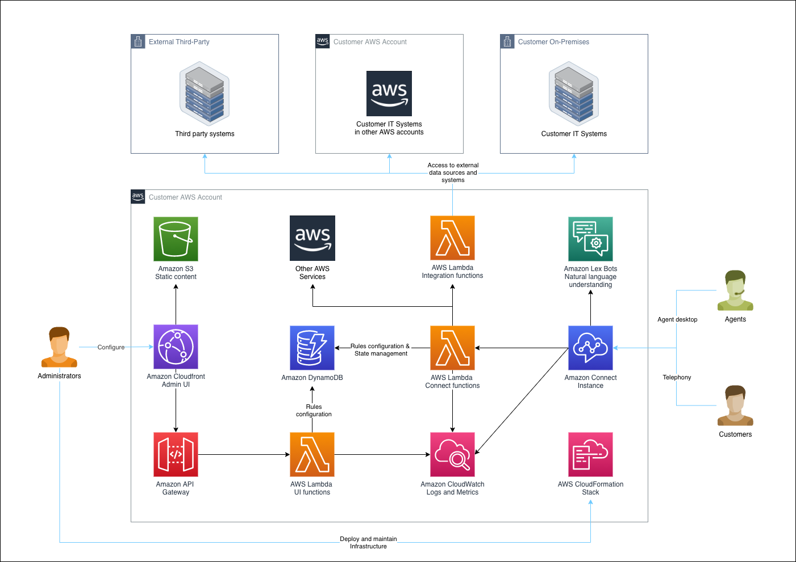
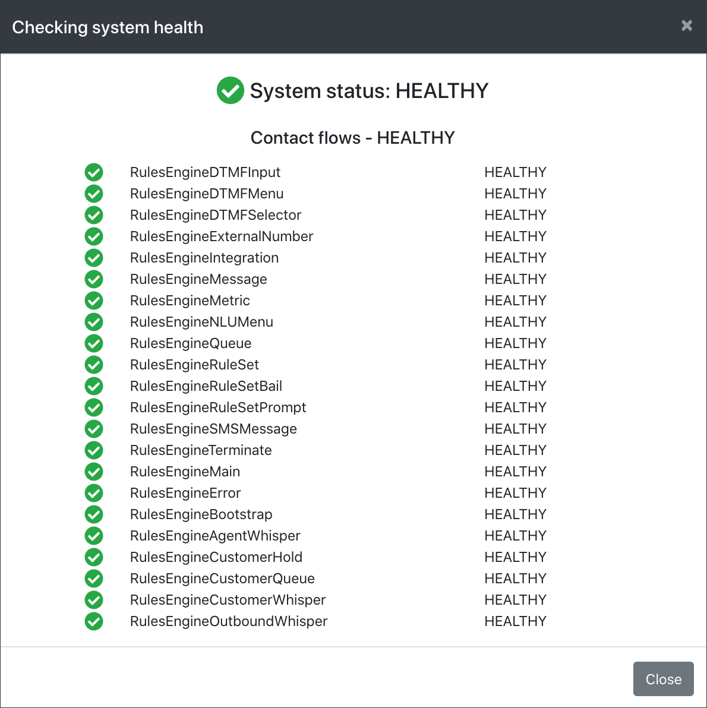

# Rules Engine for Amazon Connect

This project aims to deliver an engine sitting on top of Amazon Connect which has the capability to build a hyper-personalised IVR experience for customers.

## Watch Training Videos

Preview the installation steps detailed below.

Preview Lex bot configuration below.

Learn to work with Weights below.

## Security controls and review

Prior to any production deployment, AWS recommends undertaking an internal customer security review and risk assessment which considers your organisation's data classification and the logging, storage and necessary security controls based on the sensitivity of capured and loaded data.

Things to consider include but are not limited to:

- Logging of PII data to AWS CloudWatch in integration AWS Lambda functions
- Consideration of your organisation's data classification and how this matches data captured from your customers and loaded through integration functions
- The potential need for encryption at rest for stored customer information in the temporary Amazon DynamoDB state table

## Launch an Amazon Connect Instance

Create a new Amazon Connect instance or choose an existing instance.

The Rules Engine has a 1:1 relationship with an Amazon Connect instance.

If you are creating a new instance you may need to raise AWS Limit requests to increase the number of available phone numbers (> 10) and concurrent calls (> 10).

## Deploy the solution

Check out the git repository locally.

For each step, scripts are provided which utilise an environment file to set up the required properties.

### [Optional] Create a local AWS credentials profile

If running locally create an AWS Credentials profile using an AWS API key with elevated privileges. [Help Link](https://docs.aws.amazon.com/cli/latest/userguide/cli-configure-files.html)

If running on an EC2 instance or through CodeBuild you may use the instance's provided IAM role or inject [AWS credentials via environment variables](https://docs.aws.amazon.com/sdk-for-javascript/v2/developer-guide/loading-node-credentials-environment.html).

### Clone and configure environment files

Start by cloning and editing environment files including information about the selected Amazon Connect instance for example for a dev environment:

	cp env/example.sh env/dev.sh
	cp data/users/example-admin.json data/users/dev-admin.json

Edit the new environment specific files to fill out the required fields (placeholders are marked internally with 'TBA').

The fields are explained in the table below:

| Filename | Field Name | Meaning |
| ------------------- |  ------------------- |  ------------------- |
| env/dev.sh | stage | The short name for the environment type (dev/ preprod/ prod) |
| env/dev.sh | profile | The AWS profile name created with credentials |
| env/dev.sh | region | The default AWS region for serverless deployment |
| env/dev.sh | accountNumber | The AWS account number |
| env/dev.sh | instanceId | The Amazon Connect Instance ID |
| env/dev.sh | environmentName | Name of this environment displayed in the banner |
| data/users/dev-admin.json | UserId | The internal UserId for the admin user. You may use [uuidgenerattor.net](https://www.uuidgenerator.net/version4) or [generate on Linux command line](https://linoxide.com/how-to-generate-uuid-in-linux/) |
| data/users/dev-admin.json | APIKey | The API key for the admin user to login with. You may use [uuidgenerattor.net](https://www.uuidgenerator.net/version4) or [generate on Linux command line](https://linoxide.com/how-to-generate-uuid-in-linux/) |

### Install dependencies

[Install JQ](https://stedolan.github.io/jq/download/)

[Install AWS CLI](https://docs.aws.amazon.com/cli/latest/userguide/getting-started-install.html)

[Install node.js](https://nodejs.org/en/download/)

[Install serverless](https://www.serverless.com/framework/docs/getting-started/)

Run from the project root location:

	npm install -g serverless

### Create a deployment bucket

Create a deployment bucket for deploying code by editing and executing this script passing your environment name:

    ./scripts/rules_engine_create_deployment_bucket.sh dev

### Deploy the solution

Deploy the solution by executing this script passing your environment name:

    ./scripts/rules_engine_serverless_deploy.sh dev

### Deploy the sample Amazon Lex V2 Bots

Deploy the sample Amazon Lex V2 bots using the provided script passing your environment name:

	cd lex
	./build_all.sh dev

## Open the web app

Open the output CloudFront url in Chrome:

	Build deployment complete, site URL:
	https://xxxxx.cloudfront.net

Log in using the edited admin credential API you entered into:

 	data/admin/dev-admin.json

Successful login should load Connect data and show the home page:

Use the admin screen to create a new admin user and note the API key you will need to log in. Log out and log in as your new admin user.

## Service Limits for Amazon Connect

Ensure the [service limits](https://docs.aws.amazon.com/connect/latest/adminguide/amazon-connect-service-limits.html) for your Connect instance are set to appropriate levels. For the Rules Engine, it is recommended to have:

| Item | Default value | Recommended |
| ------------------- |  ------------------- |  ------------------- |
| Concurrent active calls | 10 | 100 (or as per business requirements) |
| Phone numbers | 5 | 10 (or as per business requirements) |

## Check and repair system health

Go to the admin page and click on the *System health* button:

If prompted, use the *Repair environment* button to install all of the required contact flows.

The system repairing:

The system repaired:

A subsequent health health check shows healthy status:

## Refresh Connect Cache

Contact flow ARNs, phone numbers, operating hours, prompt ARNs, Lambda functions and Lex Bot arns are cached in a DynamoDB config table hourly.

If you want to immediately refresh all cached config use the *Refresh cache* button to force an immediate cache refresh (useful if you have just claimed new phone numbers or created new queues).

Refreshed cache data is automatically detected and loaded by all clients.

## Create Rulesets and Rules

Uses the Rules tab to create and edit rulesets which define your customer's experience.

## Dynamic network graph

Use the Graph tab to view an interactive netwrok graph of your rulesets:

Filter your graph to highlight rulesets of interest:

## Edit upcoming holidays

Use the built in holiday editor to create upcoming holidays:

## Editing, adding and extracting Contact Flows

To edit a contact flow or create a new one, use the Amazon Connect console and make the required changes in the visual contact flow editor.

Run the extract flows script passing your environment name:

	./scripts/rules_engine_extract_flows.sh dev

This will extract all known contact flows into:

	./connect/contactflows/

You will be able to see changed contact flows using git status.

Add new rules contact flows to the bottom of:

	rules_engine_extract_flows.sh

Commit the required changes to git and then re-deploy to another environment, checking system health and repairing as required.

## Automating deployment using AWS CodePipeline

To create a pipeline for your RuleEngine instance to auto deploy you enhancements, follow the instructions [here](pipeline-setup.md).

## Extending using Integration Functions

Read more about extending your solution using Lambda Integration functions [here](EXTENDING.md).
