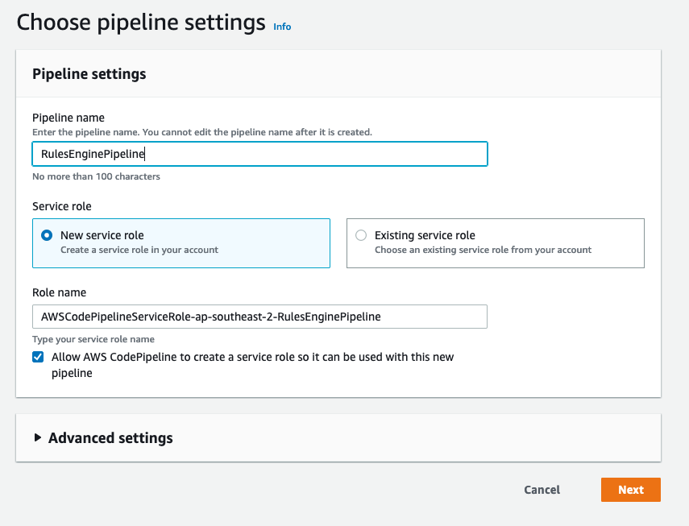
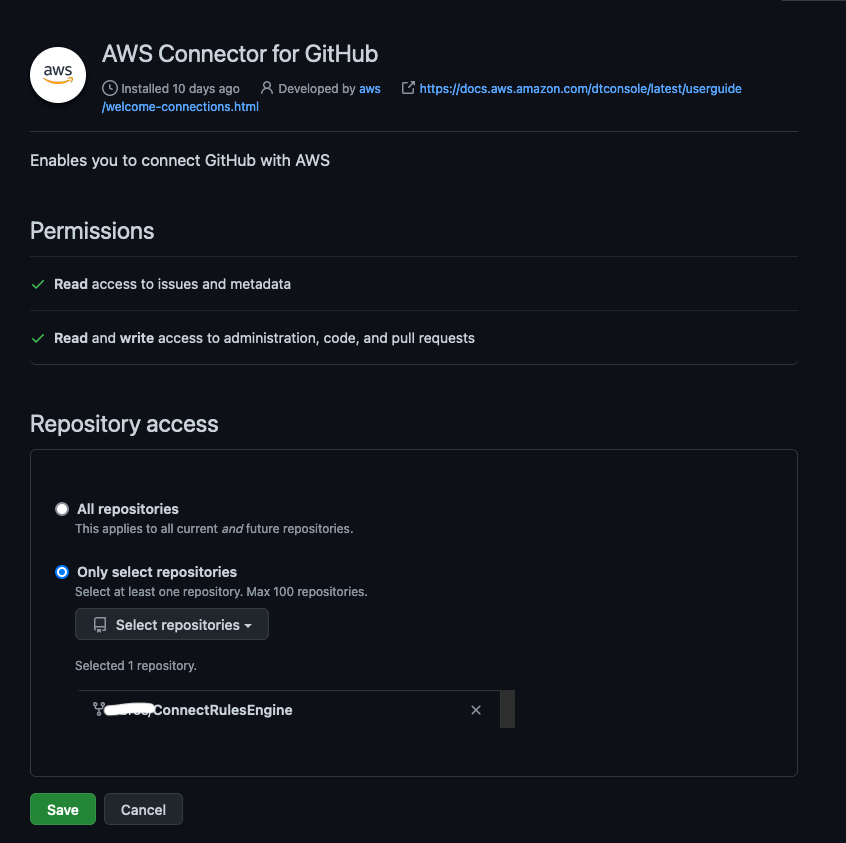
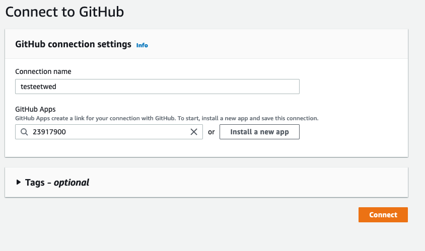
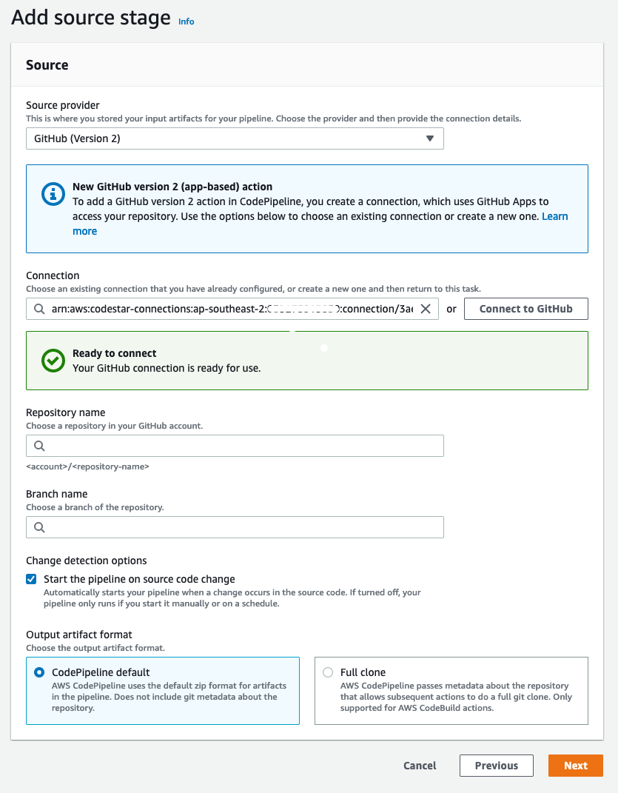
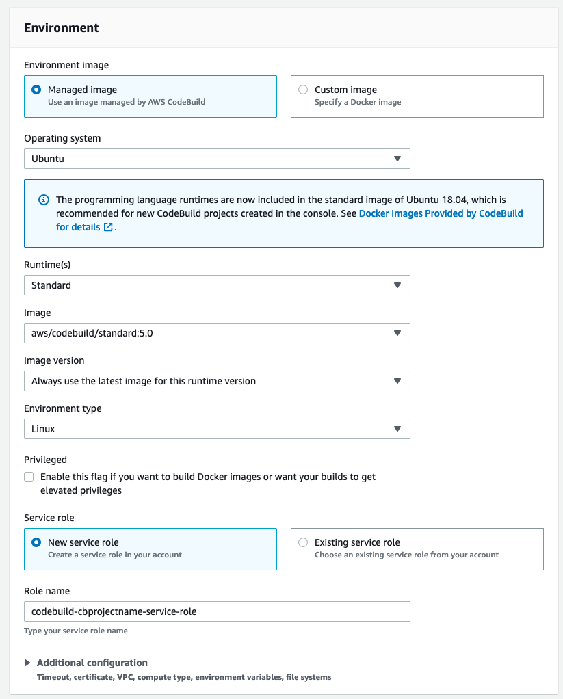
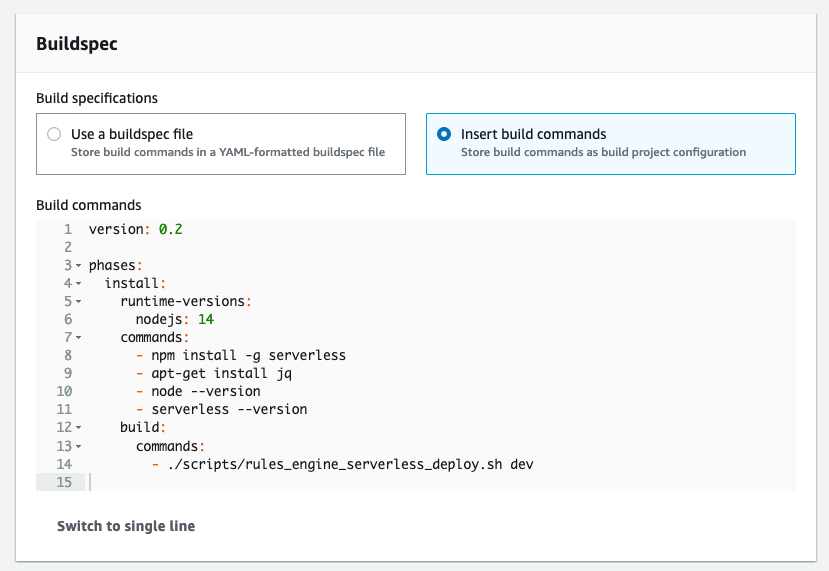
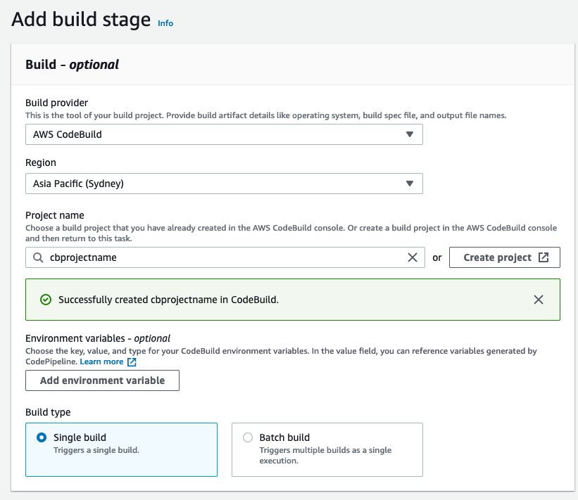

# How to build Code Pipeline for Rule Engine

This article is for developers who are setting up Rule Engine CI/CD pipeline in their environment. You can use almost any pipeline tool that allows you to deploy within your environment. This article shows how we setup AWS Code Pipeline and AWS Code Build services using an auto-trigger from a Github repository.

## Steps for creating pipeline

- Create your Github repository where you host your modified Rules Engine code
- Create AWS Code Pipeline with your source as the Github repo
- Add Build specifications
- Make a code push to Github repo

### Create Github repository

Once you have a forked the source Github repo into your our private repo, you can start pushing your changes to this.
AWS Code Pipeline can be connected with your repo and a deployment can be auto triggered one you make a push.
You may setup your Github repo secure access in your preferred way.

### Create AWS Code Pipeline
- Login to AWS console and browse to service AWS Code Pipeline
- Click Create Pipeline

#### Step 1
- Enter a name for the new Pipeline
- Select new service role
- You can adjust Advanced settings as required or leave as set by default
- Click Next



#### Step 2
- From the Source provider dropdown, select *Github (Version 2)*
- Under the Connection, select *Connect to GitHub* button
- A popup window will open, give a connection reference name and select *Connect to GitHub* button
- Select *Install a new app*
- This will take you to GitHub login screen. Login using your GitHub credentials and provide access permissions for the repository where you will be pushing your changes. Click *Save*





- When redirected back to the AWS Connect to Github page, click *Connect*
- Back in the Add source stage page, choose Repository name and Branch name from the list
- Click *Next* button



#### Step 3
- On the Add build stage page, select *AWS CodeBuild* from  Build provider dropdown
- Select *Create project* under the Project name
- In the popup window for new CodeBuild project,
	-	Enter Project name
	- Environment image: Managed image
	- Operating System: Ubuntu
	- Runtime(s): Standard
	- Image: aws/codebuild/standard:5.0
	- Image version: Always use the latest image for this runtime version
	- Environment Type: Linux
	- Service role: New service role
	- Build specifications: Insert build commands
	- under the Build commands, Select *Switch to editor* and enter the following specifications:
	- Select *Continue to CodePipeline* button

```
version: 0.2
phases:
	install:
		runtime-versions:
			nodejs: 14
		commands:
			- npm install -g serverless
			- apt-get install jq
			- node --version
			- serverless --version
		build:
			commands:
				- ./scripts/rules_engine_serverless_deploy.sh dev
```






- Back on the Add build stage, select *Next*



#### Step 4
- Select *Skip deploy stage* and select *Skip* again on the warning popup

#### Step 5
- Review the settings and select *Create pipeline*

### Conclusion

You now have a working CI/CD pipeline setup connected with your GitHub repository. Each time you push any changes to the repository, the Pipeline will release change and update the RulesEngine cloudformation. The update is self managed by the serverless scripts that have been provided with the RulesEngine.

## Happy Routing!
